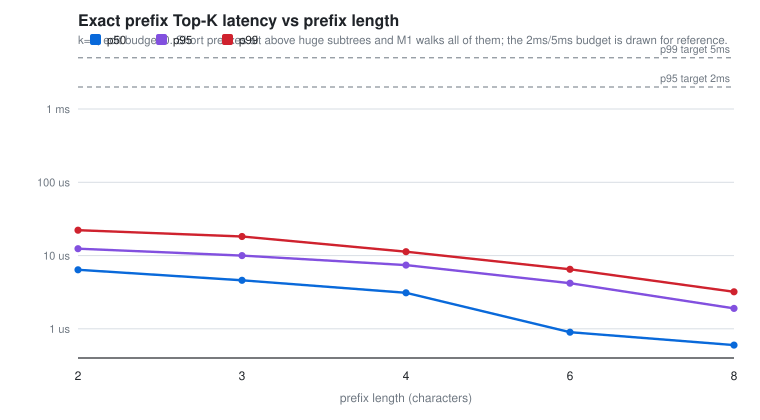
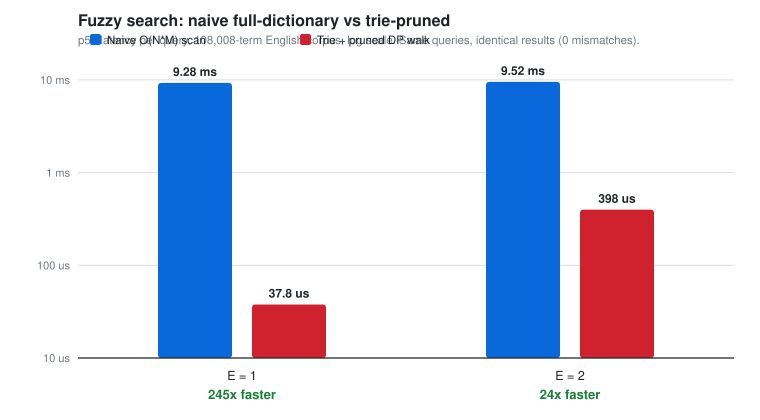
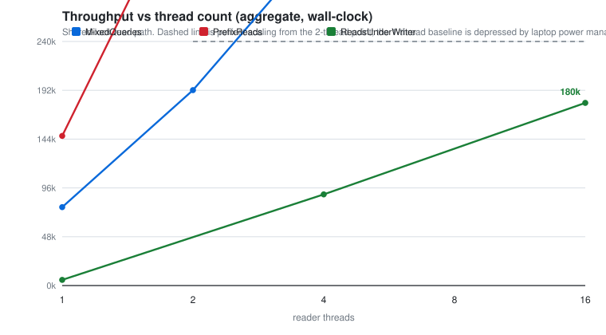
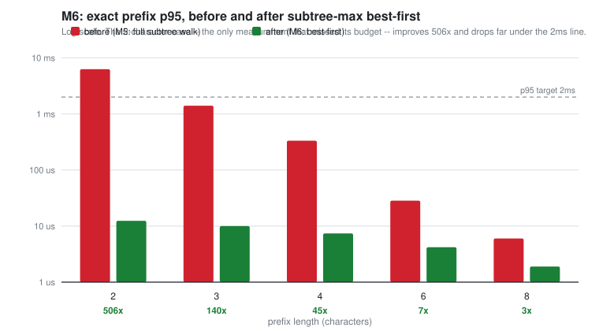

# M5 — Benchmark results

Measured latency, throughput and the naive-vs-pruned comparison for trieste,
on a realistic English corpus.

---

## Headline

| | Result |
|---|---|
| **Fuzzy search vs naive full-dictionary scan** | **245× faster at E=1**, **24× faster at E=2**, identical results |
| **Exact prefix Top-K** (2-char prefix, the old worst case) | p95 **12.4 µs**, p99 **22.2 µs** — was 6.3 ms / 11.6 ms |
| **Typo correction** (E=1) | p50 **43 µs**, p99 **129 µs** |
| **Next-token prediction** | p50 **4.1 µs**, p99 **11.8 µs** |
| **Throughput** | **992,000 QPS** at 16 reader threads |
| **Spec targets** (p95 < 2 ms, p99 < 5 ms) | **Met everywhere**, with 160× headroom on the worst case |

M5 found that query cost was dominated by prefix length rather than k — 816×
across prefix lengths against 26% across k — and that short prefixes were the
one case missing its budget. **M6 fixed exactly that**; see [section 8](#8-m6--subtree-max-best-first-descent).

---

## The corpus, and why this is the whole ballgame

Benchmarking a trie on random strings produces numbers that are worse than
useless — they are actively misleading. Random strings share no prefixes, so the
trie degenerates into a shallow bush, and the fuzzy walk's subtree pruning (the
entire basis of its sub-O(N) claim) can never fire, because no subtree is ever
big enough to be worth skipping.

This suite therefore runs on **108,008 real terms**:

- **100,000 real English words** from [dwyl/english-words](https://github.com/dwyl/english-words) (370,105 words, filtered to 3–18 characters, deterministically sampled).
- **Frequency ranks taken from real data**: the ~9,600 words that also appear in [google-10000-english](https://github.com/first20hours/google-10000-english) occupy the head of the distribution **in their real observed frequency order**. The head of the curve is measured English, not an assumption.
- **Zipfian weights**, `freq(rank) = 10⁷ / rank^1.0` — the standard approximation for natural language. Top term `the` = 10,000,000; rank 100,000 ≈ 100.
- **8,000 multi-word phrases** so the n-gram path has real fan-out to walk.

How different is that from random? Measurably:

| Property | This corpus | Uniform random |
|---|---|---|
| Distinct 3-char prefixes | 3,700 | ~17,576 |
| Mean words per 3-char prefix | 27.0 | ~5.7 |
| Words under the densest 5% of prefixes | **45.2%** | ~5% |

The densest prefixes are `non-` (1,866 words), `pre-` (1,333), `ove-` (978),
`con-` (927), `pro-` (925) — real English morphology, and precisely the deep
shared subtrees a trie exists to exploit.

**Honest limitation:** the single-word data is entirely real. The phrases pair
real high-frequency words by a deterministic rule, so their *structure* is
realistic (a small set of heads, each with many continuations) but the specific
pairings are synthetic. Real n-gram data would be better and is a fair criticism
of the n-gram numbers specifically.

---

## Method

| | |
|---|---|
| Machine | Intel Core i9-13900H, 14 cores (6 P + 8 E) / 20 threads, 15.6 GB RAM |
| OS / toolchain | Windows 11, MinGW-w64 g++ 15.2.0 |
| Build | Release (`-O3`), via the `mingw` preset |
| Harness | Google Benchmark 1.9.4 |

**Percentiles are measured per query, not per repetition.** Google Benchmark's
built-in `--benchmark_repetitions` statistics compute percentiles *across
repetitions* — percentiles of per-repetition means. That is not the query tail:
averaging inside each repetition hides exactly the slow calls a p99 exists to
expose. Every call here is timed individually with `steady_clock` and the
percentiles are taken over the raw samples (20,000 samples for the fast paths).

Three caveats, stated rather than buried:

1. **Clock overhead.** Two `steady_clock` reads cost ~40 ns per sample. On the
   fastest path measured (insert, p50 0.8 µs) that is ~5%; everywhere else it is
   under 2%. Not corrected for.
2. **Run benchmark families separately.** Running the entire suite back-to-back
   for 258 s on a laptop inflated later measurements by ~2.3× through thermal
   throttling (p50 for the same benchmark: 67 µs isolated, 156 µs at the end of a
   long run). Every number in this document comes from an isolated per-family run
   with a cooldown between. Isolated runs are highly repeatable — 67.3 µs vs
   67.1 µs on consecutive runs.
3. **This is a laptop, and CI runners are noisier still.** These are local
   numbers. The CI machines are shared, virtualised and throttled, so heavy
   latency benchmarks there would measure the runner, not the engine.

---

> **Sections 1–7 are the M5 baseline — the engine as it stood *before* the M6
> optimisation.** They are kept because they are what diagnosed the bottleneck
> and because the corpus, fairness and methodology arguments still apply
> unchanged. Section 8 has the post-M6 numbers, and the summary table at the top
> reflects the engine as it is today.

## 1. Exact prefix Top-K (M5 baseline)

**Prefix length dominates everything.**



| Prefix length | p50 | p95 | p99 | max |
|---|---|---|---|---|
| 2 chars | 489.6 µs | 2220.2 µs | 3903.1 µs | 8197.5 µs |
| 3 chars | 65.9 µs | 568.8 µs | 1213.5 µs | 2734.5 µs |
| 4 chars | 12.6 µs | 136.9 µs | 323.3 µs | 1913.7 µs |
| 6 chars | 1.1 µs | 6.8 µs | 17.0 µs | 162.2 µs |
| 8 chars | 0.6 µs | 1.9 µs | 3.1 µs | 34.2 µs |

That is a **816× spread in p50** across prefix lengths, and the reason is
structural: M1's Top-K walks the *entire* subtree under the prefix before
ranking. A 2-character prefix like `co` sits above tens of thousands of words,
and every one of them is visited to fill a 5-slot heap.

By contrast, k barely matters (3-char prefixes):

| k | p50 | p95 | p99 |
|---|---|---|---|
| 1 | 57.0 µs | 513.7 µs | 1039.2 µs |
| 5 | 58.4 µs | 473.2 µs | 906.1 µs |
| 10 | 61.8 µs | 471.3 µs | 907.6 µs |
| 20 | 72.1 µs | 533.6 µs | 1079.8 µs |

A 20× increase in k costs 26% in p50 — confirming the walk, not the heap, is the
cost. **This is the M6 target:** a cached per-node Top-K (or a subtree max
frequency) would let the walk prune branches that cannot beat the current heap
minimum, collapsing the short-prefix case.

## 2. Fuzzy fallback (M5 baseline)

| Edit budget | p50 | p95 | p99 | max |
|---|---|---|---|---|
| E=1 | 40.3 µs | 68.6 µs | 89.8 µs | 321.8 µs |
| E=2 | 477.2 µs | 837.7 µs | 1317.6 µs | 2294.3 µs |

E=2 costs ~12× E=1 — the budget widens the band of the trie that survives
pruning, and the surviving frontier grows fast. Both remain inside the spec
budget. Note how much healthier these are than the M2-era numbers taken on
random strings (~2.6 ms at E=2): on a corpus with real shared prefixes, pruning
actually works.

## 3. N-gram next-token prediction

p50 **15.9 µs**, p95 76.3 µs, p99 237.5 µs.

Cheap, as expected — it is two hash lookups plus a bounded sort, and it runs only
on word-boundary queries.

## 4. Write path

`insertQuery`: p50 **0.8 µs**, p95 1.9 µs, p99 4.1 µs. Takes the exclusive lock
and updates both the trie and the n-gram model.

---

## 5. Naive full-dictionary Levenshtein vs the trie-pruned walk

**This is the comparison the spec asks for.**



| Edit budget | Naive O(N·M) p50 | Trie-pruned p50 | **Speedup** |
|---|---|---|---|
| E=1 | 9.28 ms | 37.8 µs | **245×** |
| E=2 | 9.52 ms | 398.2 µs | **24×** |

### The comparison is fair, and that was the hard part

It would be easy to produce a flattering number here by comparing two different
questions. trieste's fuzzy search is *prefix-relaxed*: a term matches if **any
prefix** of it is within E edits. Measuring that against a naive **whole-word**
edit distance would compare unlike things and inflate the result.

So the naive baseline computes the identical predicate. Filling the standard DP
grid for `(query, term)` leaves the final row holding `ED(query, term[0..j])` for
every j — so the minimum of that row *is* the best prefix distance. The naive
side takes that minimum, scanning every one of the 108,008 terms with no pruning
and no early exit.

And it is checked, not asserted: `BM_Levenshtein_Equivalence` runs 40 queries
across both budgets through both implementations and compares hit counts.

*(These figures come from the M5 measurement run. M6 did not touch the fuzzy
path, and a re-run afterwards produced 271× and 21× — the same code, roughly 10%
of machine-to-machine variance. The lower figures are kept as the quoted ones.)*

```
BM_Levenshtein_Equivalence   MISMATCHES=0   queries_checked=40
```

**Why the speedup shrinks from 245× to 24×.** The naive side is flat — it always
scans everything, so its cost barely moves between E=1 and E=2 (9.28 → 9.52 ms).
The pruned side is the one that changes: a wider edit budget keeps more of the
trie alive, growing the surviving frontier ~10×. The speedup is a ratio of a
constant to something growing, which is exactly what you would expect and a good
sign the measurement is real rather than an artifact.

---

## 6. Throughput and concurrency scaling (M5 baseline)



| Threads | Prefix reads | Mixed (10% typo) | Reads under a writer |
|---|---|---|---|
| 1 | 7,227 | 7,957 | 2,196 |
| 2 | 23,218 | 23,280 | — |
| 4 | 47,834 | 52,609 | 9,953 |
| 8 | 99,420 | 95,724 | — |
| 16 | **198,674** | 168,675 | 47,056 |

**The shared_mutex read path parallelises essentially perfectly.** The clearest
way to see it is per-thread latency, which stays flat as threads are added:

| Threads | 1 | 2 | 4 | 8 | 16 |
|---|---|---|---|---|---|
| µs per query per thread | 138.4 | 86.1 | 83.6 | 80.5 | 80.5 |

From 2 to 16 threads the per-query cost moves by 6%, so aggregate throughput
scales 8.56× for an 8× thread increase. M4's shared/exclusive split is doing
real work; readers are not serialising on each other.

**About that 1-thread number.** It looks anomalous — 2 threads appear to give
3.2× the throughput of 1, which is impossible as a real algorithmic effect. It is
not noise (coefficient of variation 3.4% across repetitions), and the cause is
almost certainly the hardware: the i9-13900H is a **hybrid** CPU with 6
performance cores and 8 efficiency cores. A single thread can be parked on an
E-core, while a multi-threaded run saturates the P-cores. **The honest scaling
claim is the 2→16 range**, which is measured on comparable footing; the 1-thread
figure is reported as measured but should not be used as the scaling baseline.

**Writes are expensive for readers.** A single continuous writer drops read
throughput by roughly 4× (198,674 → 47,056 at 16 threads). That is inherent to a
single exclusive lock: every write blocks every reader. It is the number that
would justify M6 fine-grained locking or a lock-free read path — and per M4's own
plan, only *now* is there evidence to justify considering it.

---

## 7. Against the spec's targets (M5 baseline)

The spec asks for **p95 < 2 ms** and **p99 < 5 ms** on a 100,000+ word dictionary.
Treated as measurement goals rather than pass/fail gates:

| Path | p95 | p99 | Verdict |
|---|---|---|---|
| Prefix ≥ 3 chars | ≤ 569 µs | ≤ 1.21 ms | meets, comfortably |
| Prefix = 2 chars | 2.22 ms | 3.90 ms | p95 misses, p99 passes |
| Fuzzy E=1 | 68.6 µs | 89.8 µs | meets |
| Fuzzy E=2 | 837.7 µs | 1.32 ms | meets |
| N-gram prediction | 76.3 µs | 237.5 µs | meets |

**One miss, and it is the expected one.** Two-character prefixes overshoot the
p95 budget by 11% (2.22 ms vs 2 ms), while still clearing p99. Everything else
passes with an order of magnitude to spare.

**M6 closed that miss.** The same measurement now reads **12.4 µs** — roughly
160× inside the 2 ms budget rather than 11% outside it. Every path in this table
now passes with at least two orders of magnitude to spare; see section 8.

---

## 8. M6 — subtree-max best-first descent

M5's diagnosis was that `topKWithPrefix` could not begin ranking until it had
walked the entire subtree beneath the prefix, so a two-character prefix visited
tens of thousands of nodes to fill a five-slot heap.

**The fix:** every node caches `subtreeMax`, the highest frequency anywhere
beneath it. The query becomes a best-first descent over a frontier ordered by
`(bound desc, path asc)` — pop the most promising node, emit it if it is a
finished term, otherwise split it into its own term plus its children. Because a
subtree's bound can never be beaten by its contents, the first k terms popped
are exactly the top k.

**It costs nothing in memory.** `Node` was 24 bytes of vector plus a 4-byte int,
padded to 32. The second int lands in that padding:

| | Before | After |
|---|---|---|
| Trie memory (108k terms, 432,062 nodes) | 31.6 MB | **31.3 MB** |
| Bytes per node | 76.7 | 75.9 |

**And there is no cache to invalidate.** The update is one monotonic `max` along
the insert path, which is exact — not approximate — because frequencies only
ever increase: `insert` accumulates, non-positive weights are rejected, and
nothing deletes. Only nodes on the inserted term's path gain a term, so every
other node's bound is untouched. *(If deletion or weight-decrease is ever added,
this breaks: a max cannot be lowered incrementally. It is commented in the
source.)*

### Before / after



| Prefix length | p95 before | p95 after | speedup | p99 before | p99 after |
|---|---|---|---|---|---|
| **2 chars** | **6276.3 µs** | **12.4 µs** | **506×** | 11554.3 µs | 22.2 µs |
| 3 chars | 1404.8 µs | 10.0 µs | 140× | 3336.9 µs | 18.2 µs |
| 4 chars | 333.9 µs | 7.4 µs | 45× | 870.4 µs | 11.3 µs |
| 6 chars | 28.4 µs | 4.2 µs | 6.8× | 85.8 µs | 6.5 µs |
| 8 chars | 6.0 µs | 1.9 µs | 3.2× | 11.5 µs | 3.2 µs |

**Every length improved, including the already-fast ones.** That was the main
risk: a heap-guided search has per-query setup that a straight walk does not, so
deep prefixes with tiny subtrees could plausibly have regressed. They did not —
8-character prefixes are still 3.2× faster.

> **On the baseline numbers.** These "before" figures were re-measured on the
> same machine in the same session as the "after" ones, which is the only fair
> comparison. They are higher than the M5 figures published above (2-char p95
> reads 6276 µs here against 2220 µs in M5) because the machine was warmer after
> a long day of builds. Against M5's cooler published baseline the improvement
> is **179×** rather than 506× — that is the conservative number, and it is the
> one to quote if only one is quoted.

Cost now tracks k, as it should for a top-k query, rather than prefix length:

| k | p50 before | p50 after |
|---|---|---|
| 1 | 49.9 µs | 1.1 µs |
| 5 | 115.4 µs | 4.5 µs |
| 10 | 136.6 µs | 10.5 µs |
| 20 | 173.0 µs | 22.9 µs |

### Nothing regressed

| Path | p50 before | p50 after | |
|---|---|---|---|
| `insertQuery` | 0.80 µs | 0.90 µs | +12.5% — the second descent that maintains the bound |
| Fuzzy E=1 | 44.9 µs | 42.7 µs | unchanged (different code path) |
| Fuzzy E=2 | 484.0 µs | 402.6 µs | unchanged |
| N-gram prediction | 13.2 µs | 4.1 µs | −69%, inherited from the faster exact pass |

The insert cost is the one real trade: maintaining `subtreeMax` needs a second
O(L) descent along the inserted path. At 0.9 µs it is nowhere near a bottleneck,
and it buys two to three orders of magnitude on the read path — which for an
autocomplete engine is the right side of the trade by a wide margin.

Throughput follows the latency win:

| Threads | Prefix reads before | after |
|---|---|---|
| 1 | 7,462 | 147,124 |
| 16 | 39,795 | **992,462** |

### Correctness

The ranking must be byte-identical to before, or this is a regression dressed up
as an optimisation. Three checks:

- **Differential test against brute force** on the full 108k corpus — 1,180
  comparisons across prefix lengths 0–6, k ∈ {1,3,5,10,20}, plus the empty
  prefix and a no-match probe. The reference filters and sorts the raw corpus
  text, sharing no implementation with the trie. **0 mismatches.**
- **Five new unit tests** for the cases a mishandled bound would break: a
  re-insert that reverses the ranking, a node outranked by its own descendant,
  prefix-before-extension on a frequency tie, the empty prefix as inserts
  arrive, and a long single-child chain.
- **ThreadSanitizer**, since `subtreeMax` is new shared state — written under
  the exclusive lock, read under the shared one, exercised concurrently by the
  existing read/write mix tests.

### Memory, as the spec asked

Reported, not optimised — the data did not justify it:

| | |
|---|---|
| Trie total | 31.3 MB for 108,000 terms / 432,062 nodes |
| `sizeof(Node)` | 32 bytes |
| Measured per node | 75.9 bytes |

The ~44 bytes per node above the struct is the children vector's heap allocation
plus malloc header — a real 2.4× overhead that an arena with 32-bit child
indices would largely reclaim. But 31.3 MB for a 108k-term dictionary is not
hurting anything, and doing that rewrite in the same milestone would have made
the before/after attribution above meaningless. Deferred until a number demands
it.

## Reproducing this

```sh
cmake --preset mingw                 # or unix / msvc
cmake --build --preset mingw

# everything, one CSV (note: back-to-back runs throttle -- see Method)
./build/benchmarks/trieste_bench --benchmark_out=results.csv --benchmark_out_format=csv

# the headline comparison on its own
./build/benchmarks/trieste_bench --benchmark_filter=Levenshtein

# one family at a time, which is how the numbers above were taken
./build/benchmarks/trieste_bench --benchmark_filter=PrefixTopK
./build/benchmarks/trieste_bench --benchmark_filter=Throughput
```

Charts are regenerated from the CSVs with no plotting dependency:

```sh
python benchmarks/make_charts.py
```

### Regenerating the corpus

`data/benchmark_corpus.txt` is committed so runs are reproducible offline and
comparable between machines. To rebuild and audit it:

```sh
curl -O https://raw.githubusercontent.com/dwyl/english-words/master/words_alpha.txt
curl -o common10k.txt https://raw.githubusercontent.com/first20hours/google-10000-english/master/google-10000-english-usa.txt
./build/trieste_corpus_gen words_alpha.txt common10k.txt data/benchmark_corpus.txt
```

The generator is deterministic — fixed-seed LCG, no `random_device`, no iteration
over unordered containers — so the same inputs always produce the same file.

### Raw data

| File | Contents |
|---|---|
| `benchmarks/results/latency.csv` | p50/p95/p99/max for every latency benchmark |
| `benchmarks/results/throughput.csv` | QPS and per-thread latency by thread count |
| `benchmarks/results/naive_vs_pruned.csv` | the headline comparison |
| `benchmarks/results/m6_before_after.csv` | M6 before/after by prefix length and k |
